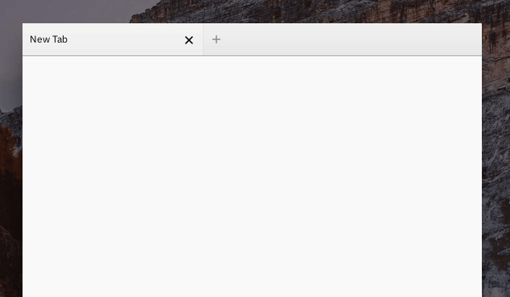

  

<h1 align='center'>
Stealthfox theme for Firefox
</h1>

Firefox customization

 

## Installation

- Automatic installation (Mac or Linux):   Type `./install.sh` to install this to your Firefox profiles.

- Manual installation:   Copy [userChrome.css](./userChrome.css) to your Firefox profile folder's `chrome/` subfolder (you may need to create it first).

## How do you use it?

- `Ctrl+L` (or `Cmd+L`) will bring focus to the navbar. This lets you interact with the navbar buttons, or type in a URL.

- You can also right-click on a page to bring the popup menu to navigate back, forward, and so on.

## Further reading

For information on how this works, see [userChrome.css customization](http://kb.mozillazine.org/index.php?title=UserChrome.css&printable=yes) on MozillaZine.

- [userChrome.css customization](http://kb.mozillazine.org/index.php?title=UserChrome.css&printable=yes) _(kb.mozillazine.org)_
- [/r/firefoxcss](https://www.reddit.com/r/firefoxcss) _(reddit.com)_

## Thanks

**firefox-stealthfox** © 2019, Rico Sta. Cruz. Released under the [MIT] License. 
Authored and maintained by Rico Sta. Cruz with help from contributors ([list][contributors]).

> [ricostacruz.com](http://ricostacruz.com) &nbsp;&middot;&nbsp;
> GitHub [@rstacruz](https://github.com/rstacruz) &nbsp;&middot;&nbsp;
> Twitter [@rstacruz](https://twitter.com/rstacruz)

 &nbsp;

[MIT]: http://mit-license.org/
[contributors]: http://github.com/rstacruz/firefox-stealthfox/contributors
